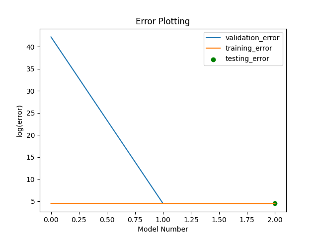

# 151AGroupProject

Overview of Data: 
Data can be found on [kaggle](https://www.kaggle.com/datasets/mysarahmadbhat/airbnb-listings-reviews). We are using the 'Listings.csv' data and the corresponding 'Listings_data_dictionary.csv', which is just a dictionary describing all the fields in Listings.csv. 

This dataset uses a public domain license described here: [CC0: Public Domain](https://creativecommons.org/publicdomain/zero/1.0/). Based on this license, we are free to copy, modify, distribute and perform the work without asking permission. 

Objective: We are building a model to predict an Airbnb's review rating.  

## Data Exploration and Initial Preprocessing (Milestone 2)

The initial data preprocessing and exploration is done in [project.ipynb](https://github.com/BrianMorse12604/151AGroupProject/blob/main/project.ipynb), linked in this github.

#### Data Preprocessing Steps:
The raw data has 279712 rows and 33 fields (columns), with 12 of these fields containing missing values. 

1. After looking through each field and its description, we dropped every column that could not be used to predict the review scores (target feature is 'review_scores_rating' which is an overall review rating): 'review_scores_accuracy', 'review_scores_cleanliness', 'review_scores_checkin', 'review_scores_communication', 'review_scores_location', 'review_scores_value'. We also dropped irrelevant columns: 'listing_id', 'name', 'host_id'.
2. Many of the host columns had the same number of missing values, and we confirmed that this meant the Airbnb didn't have information on those hosts (as many of the rows had missing values for all the columns 'host_since', 'host_is_superhost', 'host_total_listings_count', "host_has_profile_pic", "host_identity_verified"). We deleted all the rows in which the Airbnb did not have information on the host, as well as the columns that had too many missing values: host response times, host response rates, district, 
3. Many rows had missing values for the number of bedrooms, and it was a tough decision but ultimately we opted to drop all rows where the number of bedrooms was missing, considering that it'd be tough to make a decision on booking an AirBNB without its number of bedrooms.
4. We decided latitude and longitude would be redundant when city is already provided, so we dropped that variable. We'll also drop neighborhood, as we feel it's unlikely to have enough data points for each neighborhood to be of use. We'll also drop host_location, as we don't see it being effective in predicting rating.
5. Finally, we're also going to have to drop all rows where review_scores_rating is null, as this is the variable we need to predict.

After this process, our data has 168414 entries with 16 fields. This preserved 60% of the observations. The following is a breakdown of the key columns we chose to keep, and the rational behind keeping them: 

- host_since -- we want the amount of time a host has been active, as we think this would've given them time to adjust their properties to be of higher quality. We converted this into number of days the host has been active.
- All other host variables -- gives us a decent idea of the quality of the host.
- city -- gives us a good idea of their rough location.
- property_type and room_type -- the type of housing may affect how well they're generally rated
- accomodates / bedrooms -- the size of the AirBNB might follow general trends in rating
- amenities -- gives us the added benefits, which may add a convenience that'll boost rating.
- price -- rating may be correlated with pricing, one way or another. The price is initially listed in the Airbnb's local price, which we converted to USD to be consistent across the entire data.
- minimum_nights and maximum_nights -- we think that this'll add to or subtract from the convenience for the user, leading to correlation with rating
- instant_bookable -- same as above.

To ensure only numerical data: All the columns that have t/f, we converted to binary 1/0. All columns with categorical variables, with the exception of amenities, we one-hot encoded. This is "property_type", "room_type", "city". We only included the top 100 amenities. 

#### Normalizing the Data
From a boxplot of the nonbinary features, we found that features such as 'host_total_listings_count,' 'price,' 'minimum_nights,' and 'maximum_nights' have extreme outliers that we can drop. We will drop the first 10 outliers of the previously notable features mentioned. We have opted not to employ the IQR method since it would excessively constrain our dataset.

After dropping these outliers, we normalized the data.

#### Data Visualization
To get a better sense of the data:

1. We first plotted the correlations between different features, specifically the non-categorical fields. We found that the strongest correlation between our intended target class, review_scores_rating, was host_is_superhost. The next 9 features with the strongest correlation to ratings are a variety of amenities relating to food and cooking: Dishes and silverware, Cooking basics, Coffee maker, Refrigerator, Stove, Oven, Hot water, Iron, and Microwave.

2. We looked at how pricing could potentially affect rating, since we preliminary hypothesized that pricing could be a major indicator of rating. From the scatterplot, we found that there does appear to be less points at the higher end of 'price' and at the lower end of the review rating. We broke this down even more to view price plotted against review by each city. These plots showed us the same pattern, with higher priced Airbnbs having fewer lower ratings.

3. Since being a superhost was found to be our strongest correlating factor, we plotted the distribution of ratings based on superhost against the rating. We found that if the host is a superhost, the ratings are much more skewed to have a higher concentration among the 90-100% rating. Similarly, if the host is not a super host it is seen that they have slightly more reviews amongst the 20-50% range.

## First Model - Regression (Milestone 3) 
This is the link to the our notebook for our [regression model](https://github.com/BrianMorse12604/151AGroupProject/blob/main/regression.ipynb) linked in this github. 

#### Preprocessing for our Model  
In this model, the only extra preprocessing we did to add to the work done from the previous milestone was to incorporate polynomial features up to degree three and interactions for all of the features that were not binary. This was done to experiment with the features that may be important beyond simple linearity without causing too many issues since the recursive feature elimination would be able to remove any added columns that were problematic.

We did not add this preprocessing directly to the data that other models would use and instead only saved this preprocessing for our regression in case the other models would not benefit from it. However, the code is written in a function such that it could easily be incorporated for future models if desired.

#### Observation 
Our first initial model, which consisted of a simple Linear Regression model, produced an extremely high validation error of 1.2e+18 in comparison with its training error of 90.6 (around 10^16 times greater). The difference in validation and training error in combination with extreme coefficient values was a clear sign of overfitting and a failure on the model’s part to understand the true importance of different features. We attempted to fix this issue by implementing a Ridge Regression to counter larger coefficients and reduce the error. The Ridge Regression model produced very similar errors between the validation and training dataset of roughly 88.1 and 90.6 respectively. Although much better than the Linear Regression model, we made one more attempt at improving the model by using feature transformation to consider polynomial features and feature removal to remove unnecessary and non-impactful features. However, this ultimately did not improve the model as we had hoped, and our new reduced Ridge Regression model ended up producing very similar errors as the previous Ridge Regression model, 87.7 and 90.1 respectively. Following the training and finalization of our model, we tested the reduced Ridge Regression model on the testing dataset and it produced an error of 90.6.

#### Fitting Graph 
Our final reduced Ridge Regression model produced validation, training, and testing errors of roughly 87.7, 90.1, and 90.6 respectively. We can observe that all of the errors are relatively close together, leading us to conclude that we are no longer overfitting, but may be underfitting the data due to the high error values. In terms of where we are on the graph, we are on the left side before the ideal range for model complexity, with a simple model and high predictive errors. We also noticed that the validation error never seemed to increase at all as we increased the model complexity, further indicating that we were before the ideal range for model complexity.

The error plotting has to be in log to try to plot all the points in the graph, but it is clear that after the first drop in validation error that none of the error significantly changed for the better or worse, but made very marginal improvement, confirming the analysis above

#### Conclusion and Next Steps 
Upon exploring a Linear Regression model, we came to the conclusion that Linear Regression is not sufficient for predicting Airbnb's review rating given our dataset. This is demonstrated in both our initial Linear Regression model and our improved reduced Ridge Regression Model. Although consistent, our final model still produced high error values, indicating it was not accurately predicting the rating reviews. 

One possible area of improvement for this regression model includes further investigation into the importance of each of the features and their relationships with each other to see what the best subset of features truly is to limit the error, but currently, it seems like most changes would not be significant for this model’s improvement and that it would most likely only make a small decrease.

The next two models we are thinking of doing are neural networks and decision regression trees. This is because those are two other common types of models that tend to do well with regression problems and may be able to overcome the challenges that a regression model can not. These more complicated models have automatic feature learning and can recognize nonlinear relationships between data. Therefore, compared to a traditional regression model that performs well with linear data relationships, our future models may be able to recognize underlying patterns and fit the data more, thus decreasing the final error.

