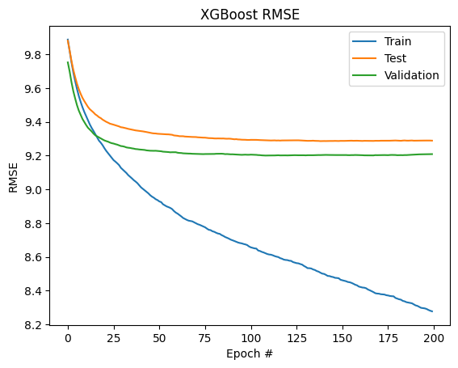

# 151AGroupProject

The group members in this project are Rachel Wei (rawei@ucsd.edu), Andrew Pu (apu@ucsd.edu), Ethan Cao (etcao@ucsd.edu), Andrew Zheng (a5zheng@ucsd.edu), Brian Morse (bkmorse@ucsd.edu), Jimmy Ying (jlying@ucsd.edu), Joshua Chen (joc042@ucsd.edu), Arvin Zhang (awzhang@ucsd.edu),
and Justin Chou (jtchou@ucsd.edu).

This README will explain our 151A group project for Winter 2024. This README contains where to find all the code for this project, as well as the project itself: an introduction to the project, dataset used, a description of our data exploration, cleaning, and preprocessing, and the process for creating the 3 different ML models as well as a comparison between the 3. All the code for this project is uploaded as a jupyter notebook to this github, and will be linked throughout the readme when relevant.

## A. Abstract

Airbnb is one of the largest short-term rental booking sites and a rental’s ratings can be instrumental in determining its profitability. As such, many hosts would like to know how a potential rental location may perform before they purchase it or how they can make improvements to current locations. Our goal is to create a predictive model that takes into account information about a rental location to predict the overall rating. We will use a regression model with features such as the number of rooms, the price of the listing, and the city of the listing that will predict the overall rating for the location. We will further process and transform the data to create new features in hopes of strengthening our predictions.

We will explore 3 ML models:

1. Various linear regression mdoels, in which we pick the model that performed the best.
2. Various tree-based ML models, in which we pick the model that performed the best.
3. Various DNN models, in which we pick the model that performed the best.

By creating these models, we hope to create a useful tool for both hosts and customers to use when making decisions about a listing.

Objective: We are building 3 ML models to predict an Airbnb's review rating.

Overview of Data: 
Data can be found on [kaggle](https://www.kaggle.com/datasets/mysarahmadbhat/airbnb-listings-reviews). We are using the 'Listings.csv' data and the corresponding 'Listings_data_dictionary.csv', which is just a dictionary describing all the fields in Listings.csv. 

This dataset uses a public domain license described here: [CC0: Public Domain](https://creativecommons.org/publicdomain/zero/1.0/). Based on this license, we are free to copy, modify, distribute and perform the work without asking permission. 

## B. Figures

### Data Visualization Figures
The following figures 1.1, 1.2, 1.3 are for data visualization purposes, and to get a better sense of the data

[Figure 1.1](https://github.com/BrianMorse12604/151AGroupProject/edit/main/writeup.md#data-visualization): This figure is described more thoroughly at the link, but gives the correlation between different features of the data.


[Figure 1.2](https://github.com/BrianMorse12604/151AGroupProject/edit/main/writeup.md#data-visualization): This figure is described more thoroughly at the link, but compares price against rating for each location.


[Figure 1.3](https://github.com/BrianMorse12604/151AGroupProject/edit/main/writeup.md#data-visualization): This figure is described more thoroughly at the link, but looks at the distribution of ratings based on whether the host is a host or superhost.


## C. Methods

### Data Exploration and Initial Preprocessing (Milestone 2)

The initial data preprocessing and exploration is done in [project.ipynb](https://github.com/BrianMorse12604/151AGroupProject/blob/main/project.ipynb), linked in this github.

#### Data Preprocessing Steps:
The raw data has 279712 rows and 33 fields (columns), with 12 of these fields containing missing values. 

1. After looking through each field and its description, we dropped every column that could not be used to predict the review scores (target feature is 'review_scores_rating' which is an overall review rating): 'review_scores_accuracy', 'review_scores_cleanliness', 'review_scores_checkin', 'review_scores_communication', 'review_scores_location', 'review_scores_value'. We also dropped irrelevant columns: 'listing_id', 'name', 'host_id'.
2. Many of the host columns had the same number of missing values, and we confirmed that this meant the Airbnb didn't have information on those hosts (as many of the rows had missing values for all the columns 'host_since', 'host_is_superhost', 'host_total_listings_count', "host_has_profile_pic", "host_identity_verified"). We deleted all the rows in which the Airbnb did not have information on the host, as well as the columns that had too many missing values: host response times, host response rates, district, 
3. Many rows had missing values for the number of bedrooms, and it was a tough decision but ultimately we opted to drop all rows where the number of bedrooms was missing, considering that it'd be tough to make a decision on booking an AirBNB without its number of bedrooms.
4. We decided latitude and longitude would be redundant when city is already provided, so we dropped that variable. We'll also drop neighborhood, as we feel it's unlikely to have enough data points for each neighborhood to be of use. We'll also drop host_location, as we don't see it being effective in predicting rating.
5. Finally, we're also going to have to drop all rows where review_scores_rating is null, as this is the variable we need to predict.

To ensure only numerical data: All the columns that have t/f, we converted to binary 1/0. All columns with categorical variables, with the exception of amenities, we one-hot encoded. This is "property_type", "room_type", "city". We only included the top 100 amenities. 

```python
tf_cols = ["host_is_superhost", "host_has_profile_pic", "host_identity_verified", "instant_bookable"]
listings_df[tf_cols] = listings_df[tf_cols].replace({'t': 1, 'f': 0})
cat_cols = ["property_type", "room_type", "city"]
listings_df = pd.get_dummies(listings_df, columns=cat_cols, dtype=int)
``` 

#### Normalizing the Data
From a boxplot of the nonbinary features, we found that features such as 'host_total_listings_count,' 'price,' 'minimum_nights,' and 'maximum_nights' have extreme outliers that we can drop. We will drop the first 10 outliers of the previously notable features mentioned. We have opted not to employ the IQR method since it would excessively constrain our dataset.

After dropping these outliers, we normalized the data.

```python
norm_input_df = filtered_input_df.copy()
norm_input_df[norm_input_df.columns] = (norm_input_df[norm_input_df.columns] - norm_input_df[norm_input_df.columns].min()) / (norm_input_df[norm_input_df.columns].max() - norm_input_df[norm_input_df.columns].min())
norm_input_df
```

#### Data Visualization
To get a better sense of the data:

1. Figure 1: We first plotted the correlations between different features, specifically the non-categorical fields. We found that the strongest correlation between our intended target class, review_scores_rating, was host_is_superhost. The next 9 features with the strongest correlation to ratings are a variety of amenities relating to food and cooking: Dishes and silverware, Cooking basics, Coffee maker, Refrigerator, Stove, Oven, Hot water, Iron, and Microwave.


2. Figure 1.2: We looked at how pricing could potentially affect rating, since we preliminary hypothesized that pricing could be a major indicator of rating. From the scatterplot, we found that there does appear to be less points at the higher end of 'price' and at the lower end of the review rating. We broke this down even more to view price plotted against review by each city. These plots showed us the same pattern, with higher priced Airbnbs having fewer lower ratings.


3. Figure 1.3: Since being a superhost was found to be our strongest correlating factor, we plotted the distribution of ratings based on superhost against the rating. We found that if the host is a superhost, the ratings are much more skewed to have a higher concentration among the 90-100% rating. Similarly, if the host is not a super host it is seen that they have slightly more reviews amongst the 20-50% range.


### First Model - Regression (Milestone 3) 
This is the link to the our notebook for our [regression model](https://github.com/BrianMorse12604/151AGroupProject/blob/main/regression.ipynb) linked in this github. 

#### Preprocessing for our Model  
In this model, the only extra preprocessing we did to add to the work done from the previous milestone was to incorporate polynomial features up to degree three and interactions for all of the features that were not binary. This was done to experiment with the features that may be important beyond simple linearity without causing too many issues since the recursive feature elimination would be able to remove any added columns that were problematic.

```python
numeric_cols = ['host_since', 'host_total_listings_count', 'accommodates',
       'bedrooms', 'price', 'minimum_nights', 'maximum_nights']

def make_polynomial_data(X, degree = 3):
    poly = PolynomialFeatures(degree,include_bias=False)

    # Separate the binary and non-binary columns apart
    X_non_binary = X[numeric_cols]
    X_binary = X.loc[:,~X.columns.isin(numeric_cols)]
    # Get the polynomial features
    X_poly = pd.DataFrame(poly.fit_transform(X_non_binary),columns=poly.get_feature_names_out())
    # Return the recombined dataframes
    return pd.concat([X_poly,X_binary.set_index(X_poly.index)],axis=1)

make_polynomial_data(X_train)
```

We did not add this preprocessing directly to the data that other models would use and instead only saved this preprocessing for our regression in case the other models would not benefit from it. However, the code is written in a function such that it could easily be incorporated for future models if desired.

#### Evolution of the Model

The first step in doing regression was to use do a simple linear regression with no extra bells or whistles attached. After that, a ridge regression model was created to explore the differences that that would create. Then a second ridge regression model was made that included the polynomial data and had recursive feature elimination cross validation to only keep the best features for the regression calculations. After some messing around with the hyperparameters, we had the RFE have ten splits and remove ten features at each step, though changing these parameters had minimal effect.

```python
# Create and fit the model
reduced_model = RFECV(ridge_model, cv=10, step=10)
reduced_model.fit(make_polynomial_data(X_train),y_train)

# Recalculate validation and train error
yhat_val = reduced_model.predict(make_polynomial_data(X_val))
val_error = mean_squared_error(y_val,yhat_val)
validation_error_list.append(np.log(val_error))
print('Validation Error:',val_error)

yhat_train = reduced_model.predict(make_polynomial_data(X_train))
train_error = mean_squared_error(y_train,yhat_train)
training_error_list.append(np.log(train_error))
print('Training Error:',train_error)

---
Validation Error: 88.11948517309538
Training Error: 90.63530505276604
```

### Second Model - Decision Tree Regressor (Milestone 4) 

This is the link to the our notebook for our [tree models](https://github.com/BrianMorse12604/151AGroupProject/blob/main/trees.ipynb) linked in this github. 

#### Evolution of the Model: 

We began with decision tree regressors and random forest regressors. We then used both XGBoost and scikit-learn’s libraries for gradient boosting regressors. Fitting each model was relatively quick, finishing in ~10 minutes.

```python
decision_tree_model=DecisionTreeRegressor()
decision_tree_model.fit(X_train,y_train)
```

#### Hyperparameter tuning, K-fold cross-validation, feature expansion

We did not perform feature expansion, as we felt confident that our feature engineering in the preprocessing stage was effective. We did perform both hyperparameter tuning and K-Fold cross validation using the GridSearchCV function. Though the grid search did find slightly more optimal errors in comparison to our models without hyperparameter tuning, we weren’t blown away by the results. 

We ran trials using a different number of folds during our grid search, and found that the difference in results was only marginal, while each search took an order of magnitude longer. Therefore, we opted to gridsearch with only two folds each time we used it, using the second fold to sanity-check the results of the first. 

```python
rf = RandomForestRegressor()
grid_search = GridSearchCV(estimator=rf, param_grid=param_grid, cv=3, n_jobs=-1, verbose=2, scoring='neg_mean_squared_error')
grid_search.fit(X_train, y_train)
```

### Third Model - Dense Neural Networks (Milestone 5)

This is the link to the notebook for our [DNN](https://github.com/BrianMorse12604/151AGroupProject/blob/main/DenseNeuralNetwork.ipynb). It is in this github.

No further data preprocessing needed.

#### Evolution of the Model:

We started by creating a preliminary dense neural network using relu activation functions and two hidden layers.

```python
model_relu = Sequential()
model_relu.add(InputLayer(input_shape=(247,)))
model_relu.add(Dense(units = 32, activation='relu'))
model_relu.add(Dense(units = 16, activation='relu'))
model_relu.add(Dense(units = 1, activation= 'relu'))
model_relu.compile(optimizer='adam', loss = 'mean_squared_error')
model_relu.optimizer.learning_rate=0.1
```

 We then performed hyperparameter tuning where we varied the activation function, the number of layers, the number of nodes per layer, the optimizer, and the learning rate. Using the most optimal combination of these values from our hyperparameter tuning, we created another dense neural network and also implemented early stopping to prevent over-fitting. 

 ```python
 def buildHPmodel(hp):
  activation = hp.Choice("activation", ['elu','relu','leaky_relu'])
  layers = hp.Int("hidden_layers", min_value=2, max_value=4, step=1)
  nodes = hp.Choice("layer_one_nodes", [32, 64, 128])
  optimizer = hp.Choice("optimizer", ['rmsprop','adam'])
  lr = hp.Float("lr", min_value=0.01, max_value=0.1, step=3, sampling="log")

  model = Sequential()
  model.add(InputLayer(input_shape=(247,)))

  for i in range(0, layers):
    model.add(Dense(units=nodes/pow(2, i), activation=activation))

  model.add(Dense(units=1, activation=activation))
  model.compile(optimizer=optimizer, loss='mean_squared_error')
  model.optimizer.learning_rate = lr
  return model
  ```

Based on our hypertuning, we found that our most optimal model has the following parameters:activation = elu, hidden_layers = 2, layer_one_nodes = 128, optimizer = adam, learning_rate = 0.09

```python
best_model = Sequential()
best_model.add(InputLayer(input_shape=(247,)))
best_model.add(Dense(units = 128, activation='elu'))
best_model.add(Dense(units = 64, activation='elu'))
best_model.add(Dense(units = 1, activation= 'elu'))
best_model.compile(optimizer='adam', loss = 'mean_squared_error')
best_model.optimizer.learning_rate=0.09
```

## D. Results

### Data Exploration and Initial Preprocessing (Milestone 2)

After this process, our data has 168414 entries with 16 fields. This preserved 60% of the observations. The following is a breakdown of the key columns we chose to keep, and the rational behind keeping them: 

- host_since -- we want the amount of time a host has been active, as we think this would've given them time to adjust their properties to be of higher quality. We converted this into number of days the host has been active.
- All other host variables -- gives us a decent idea of the quality of the host.
- city -- gives us a good idea of their rough location.
- property_type and room_type -- the type of housing may affect how well they're generally rated
- accomodates / bedrooms -- the size of the AirBNB might follow general trends in rating
- amenities -- gives us the added benefits, which may add a convenience that'll boost rating.
- price -- rating may be correlated with pricing, one way or another. The price is initially listed in the Airbnb's local price, which we converted to USD to be consistent across the entire data.
- minimum_nights and maximum_nights -- we think that this'll add to or subtract from the convenience for the user, leading to correlation with rating
- instant_bookable -- same as above.

### First Model - Regression 

#### Observation 
Our first initial model, which consisted of a simple Linear Regression model, produced an extremely high validation error of 1.2e+18 in comparison with its training error of 90.6 (around 10^16 times greater). The Ridge Regression model produced very similar errors between the validation and training dataset of roughly 88.1 and 90.6 respectively. Although much better than the Linear Regression model, we made one more attempt at improving the model by using feature transformation to consider polynomial features and feature removal to remove unnecessary and non-impactful features. However, this ultimately did not improve the model as we had hoped, and our new reduced Ridge Regression model ended up producing very similar errors as the previous Ridge Regression model, 87.7 and 90.1 respectively. Following the training and finalization of our model, we tested the reduced Ridge Regression model on the testing dataset and it produced an error of 90.6.

#### Fitting Graph 
Our final reduced Ridge Regression model produced validation, training, and testing errors of roughly 87.7, 90.1, and 90.6 respectively. We can observe that all of the errors are relatively close together, leading us to conclude that we are no longer overfitting, but may be underfitting the data due to the high error values. 


The error plotting has to be in log to try to plot all the points in the graph, but it is clear that after the first drop in validation error that none of the error significantly changed for the better or worse, but made very marginal improvement, confirming the analysis above. The model number label on the x-axis essentially describes the separation of the three major sections of progress with regression, model 0 being the standard linear regression, model 1 being the ridge regression, and model 2 being the regression that has some polynomial features and recursive feature elimination applied to it.

### Second Model - Decision Tree Regressor 

#### Observation

We decided to use the gradient boosting regression model from the XGBoost library, as it performed slightly better than both the decision tree regressor and the random forest regressor.
Our best gradient boosting model overfits slightly, with a training MSE of 68 and testing/validation MSE’s hovering in the mid-80’. However, as the result of an exhaustive grid search, we have confidence that these hyperparameters are pretty optimal, as they outperformed models that didn’t overfit and had similar training and testing errors. l Tweaking the “num_estimators” and “depth” hyperparameters had the largest impact on mitigating overfitting: we were able to bring the training MSE down to a single digit, at the cost of doubling our training/validation MSE’s by building an overly complex model with high depth.

#### Fitting Graph



Our XGBoost model had training, testing, and validation errors were roughly 68.5, 86.3, and 84.8 respectively. Looking at our XGBoost RMSE graph, our model overfits slightly as the final training and testing RMSE has a decent difference. However, the error on both our test and validation data is not yet in the area of the fitting graph where it is starting to rise as the training RMSE continues to fall. Therefore, we can conclude that our model falls roughly in the ideal range for model complexity.

### Third Model - Dense Neural Networks (Milestone 5)

#### Observation
For this model, the we implemented early_stopping to avoid the issue of overfitting. Thus, the model stopped after only 23 epochs. Compared to the preliminary model before hypertuning, the validation_error was a little lower, going down to around 91.8 at its minimum before going back up and stopping. The testing error ended up being around 92.1, which is a little better than our model without hypertuning which had a testing error of 93.3.

#### Fitting Graph
Fitting graph for initial model before hypertuning:


Fitting graph for model after hypertuning:


From these graphs, we can clearly see that for both models, the preliminary one and our final one, the errors started pretty close to each other, but they gradually separated after that, with the training_error consistently decreasing and the validation_error leveling off or even increasing. Since we set restore_best_weights to True, the final testing_loss is pretty close the minimum validation_loss instead of the final validation_loss.

### Final Model & Final Results Summary

Final Model: Model 2, Decision Tree Regressor

Out of the 3 models, we determined that Model 2, a decision tree regressor, performed the best. The Decision Tree Regressor had a testing error of 86.3 and validation error of 84.8, both of which were lower than the other testing and validation errors from our other two models. Model 1 (Regressor) had a testing error of 90.6 and validation error of 88.1. Model 3 (DNN) had a testing error of 92.1 and validation error of 91.8. Note that these errors are mse, which means that on average our models predicted around 10 points off of the actual review rating (review ratings are out of 100).

## E. Discussion

### Data Exploration and Initial Preprocessing

After exploring the data, we were able to determine which features were useful and which were not. We found that features like host_since, city, and price were likely to be useful in predicting ratings while features like neighborhood did not have much predictive power. As well, we preprocessed the data to make it more useful to us in the rest of our analysis. Performing listwise deletion on missing rows and imputing missing values where we could made our data much cleaner and assuredly lead to increased model performance.

To further explore the data, we could have created more types of visualizations like pairplots between all numerical variables to get a better sense of the relationships between them. We also could have explored geographic and time-based visualizations that would have unlocked new ideas for how to represent those kinds of features. As well, we could have tried to impute more data values instead of performing any listwise deletion in order to preserve all the data. These improvements could have led to more interesting ideas and model architectures and in future iterations, we will explore the data further and try alternative preprocessing methods to get better results.

### First Model - Regression

Upon exploring a Linear Regression model, we came to the conclusion that Linear Regression may not be sufficient for predicting Airbnb's review rating given our dataset. This is demonstrated in both our initial Linear Regression model and our improved reduced Ridge Regression Model. Although consistent, our final model still produced high error values, indicating it may not be accurately predicting the rating reviews as much as a model could be. 

One possible area of improvement for this regression model includes further investigation into the importance of each of the features and their relationships with each other to see what the best subset of features truly is to limit the error, but currently, it seems like most changes would not be significant for this model’s improvement and that it would most likely only make a small decrease.

The next two models we are doing are decision regression trees and neural networks. This is because those are two other common types of models that tend to do well with regression problems and may be able to overcome the challenges that a regression model can not. Compared to more complicated models that have automatic feature learning and can recognize nonlinear relationships between data, this traditional regression model may not be able to recognize underlying patterns or fit the data as well. 

### Second Model - Decision Tree Regressor 

Our second model only improved marginally upon our first model. Still, this family of models – the trees – had a tendency to overfit on the training data, which made sense given the complexity of each of these models. We think that these different models performing relatively similar to one another is indicative of the variance in our dataset; people, and therefore AirBNB ratings, are inherently volatile. We think that there’s a possibility that more hyperparameter tuning can decrease the error slightly, but we’re not overly hopeful that this is the case given the similar performance across the board.

### Third Model - Dense Neural Networks 

After exploring multiple Neural Network models, we came to the conclusion that Neural Networks were not the most optimal models for predicting AirBNB reviews given our dataset. Our initial iteration performed quite well, but the improvements our hyper-parameter tuning gave were minimal. We tried to see if any number of layers, nodes, or activation functions would create a large improvement, but they mostly performed relatively similarly. Despite trying many different configurations, the error only decreased by 1 point which is only slightly more than 1%. This means that without a drastic change in model architecture, a neural network is likely not the best model for this problem. Instead, a simpler model like model 1 or 2 that has more explainability is a better choice. That way, you can maintain similar performance while allowing the results to be explained and interpreted to an audience.

One possible improvement we could make is to increase max_trials for the hyperparameter tuning. Since we were restricted by time, we were not able to test all possible combinations during our hyperparameter tuning, so there may be more optimal combinations than the ones we tried. Additionally, we could also try running for more epochs during our hyperparameter tuning in order to get a better representation of each model. One pattern we noticed is that the models with higher learning_rates did a little better, but this may be due to the fact that they move towards the local minima faster than the models with lower learning_rates, which makes them appear more accurate in the short-run.

## F. Conclusion

After the entire process of working with this Airbnb data across three different models, we were able to successfully predict the ratings of different locations within 9-10%. That means we are able to typically predict with an error of half of a star which is pretty good. Surprisingly, it seems that the tree models were the best performing in completing this task, even above the neural networks. However, this still clearly demonstrates that there is still a lot of room for improvement to get even more accurate results. Given more time with the models we were working on, we may be able to implement more tactics to have better predictive power or do more hyperparameter tuning to have the best architecture available for the respective model types. One more thing to consider however is that since all three models tended to have the same loss as each other, it may also be more beneficial to have a deeper and more complex look into the data and try to find how some of the features truly effect the outcome and each other. There may also be bias into how the data was collected in the first place, like how the concentration of scores tend to be distributed and be heavily skewed positively, in which case we would need to look for other data to either supplement or replace the current data we were looking at. However, despite the different paths forward from here, we have still created a good model to be used for those looking to start putting a place up on Airbnb or for users to get an idea of what their experience may be like if there are not many reviews on the location yet!

## Contributions:
* Arvin Zhang:
  * Title/Contribution: Group Member, Contributed to the abstract (Milestone 1), Data preprocessing steps (Milestone 2), and analysis/write up of Model 1 (Milestone 3). In the abstract, helped select dataset and summarize data. Most significant contributions in the data preprocessing step includes normalizing the data, visualizing the data, and removing select possible outliers during the data preprocessing steps. Finally, worked with Brian and Josh to analyze and draw conclusions on Model 1's performance. 
* Andrew Pu:
  * Title/Contribution: Group Member, Contributed to the data exploration and initial preprocessing steps (Milestone 2), development and analysis of Model 3 (Milestone 5), and some work on the final readme (Milestone 5). Created models to visualize the relations between features and to identify useful features to use in our models. For model 3, worked on creating the dense neural network model and hypertuning the parameters, as well as creating most of the writeup for model 3, including the analysis and conclusion portions. Worked with Rachel Wei to explain development process of model 3 in the final readme.
* Andrew Zheng:
  * Title/Contribution:
* Brian Morse:
  * Title/Contribution: Group Member, Contributed to the abstract (Milestone 1), Data Preprocessing steps (Milestone 2), creation of model 1/write up (Milestone 3), and some work with final readme (Milestone 5). For the abstract, was part of choosing the dataset and some of the planning. For data preprocessing, main contribution was figuring out how to process the amenities column as well as other small changes. Was one of the team of three to work on the linear regression model code and write up. Helped make some smaller adjustments to fit the final format of the readme, largest contribution for this segment was the conclusion. 
* Joshua Chen:
  * Title/Contribution: Group Member, Contributed to the abstract (Milestone 1) and analysis/write of Model 1 (Milestone 3). Helped select the dataset and describe one of the potential Airbnb datasets we were considering using for the abstract. For Milestone 3, after Brian worked on the linear regression models, I helped to analyze and summarize our findings/graphs into conclusions/observations and edited the ReadMe. 
* Ethan Cao:
  * Title/Contribution: Group Member, Contributed to the abstract (Milestone 1), Data Preprocessing steps (Milestone 2), and Model 3 and writeup (Milestone 5). In the abstract, helped determine the dataset. In the data preprocessing, developed graphs to be submitted. In model 3 and writeup, wrote parts of the discussion section, formatted the write-up and added coding sections to make the write up presentable. Also helped develop the initial DNN model.
* Jimmy Ying:
  * Title/Contribution:
* Justin Chou:
  * Title/Contribution: Group member, contributed to the data cleaning / EDA (Milestone 1) and the second model (Milestone 4). In Milestone 1, he did the initial feature analysis and missing value imputation / dropping. In milestone 4, he worked with Andrew Z and Jimmy on the second model, with each of them testing one of the three models (decision tree, random forest, xgboost) and contributing to the write-up.
* Rachel Wei:
  * Title/Contribution: Group member, Contributed to the Abstract (Milestone 1), Data Preprocessing steps (Milestone 2), as well as the construction of Model 3 (Milestone 5), and the final writeup for the entire project (Milestone 5). Most significant contributions was in Milestone 5, specifically working with Andrew to create the initial model before hypertuning as well as the final writeup for the entire project, including reorganizing all the information to be cohesive and adding additional results, discussion, and conclusion as needed. In addition, worked on the Milestone 2 writeup.
